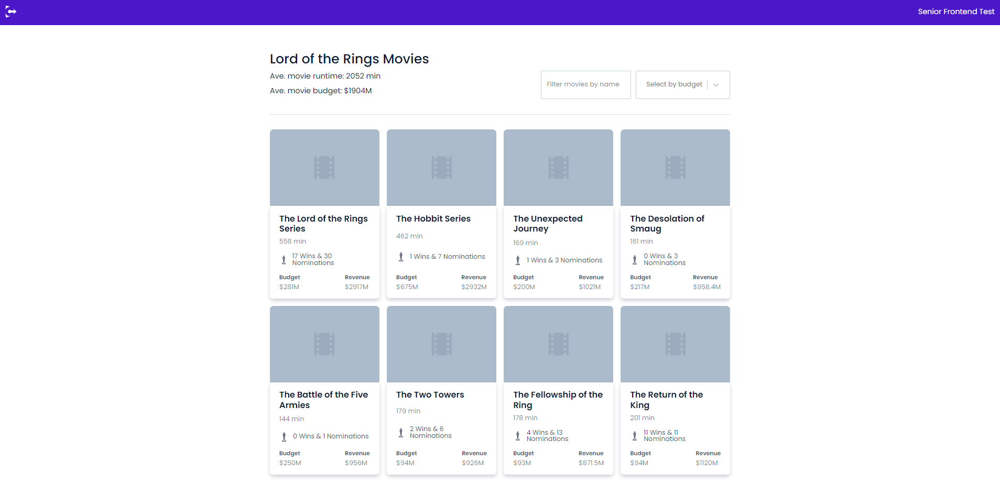
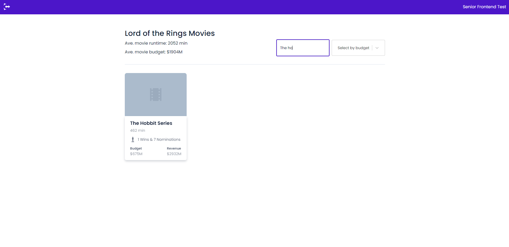
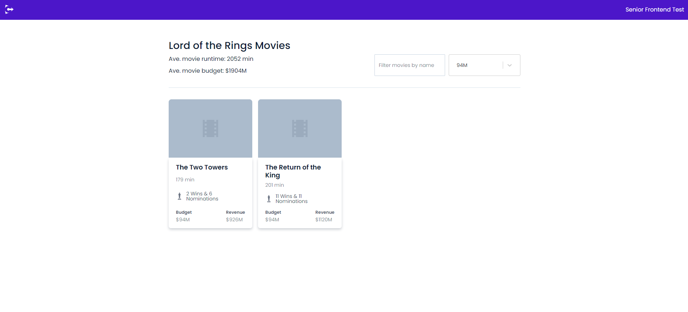
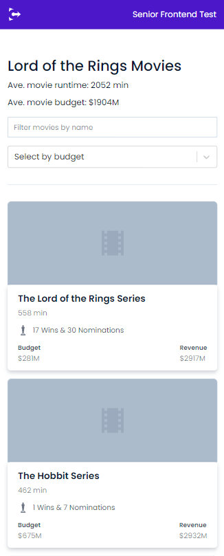

<h1 align="center">
  Convincely Senior FrontEnd Test
</h1>

<br>

<p align="center">
  <a href="#house-sobre-o-projeto">Sobre o projeto</a>&nbsp;&nbsp;&nbsp;|&nbsp;&nbsp;&nbsp;
  <a href="#computer-tecnologias">Tecnologias</a>&nbsp;&nbsp;&nbsp;|&nbsp;&nbsp;&nbsp;
  <a href="#runner-rodando-o-projeto">Rodando o projeto</a>&nbsp;&nbsp;&nbsp;|&nbsp;&nbsp;&nbsp;
  <a href="#art-autor">Autor</a>
</p>

<p align="center">
  
</p>

<p align="center">
  
</p>

<p align="center">
  
</p>

<p align="center">
  
</p>
---

## :house: Sobre o projeto

<p> O Projeto foi desenvolvido baseado no teste de front-end da empresa Convincely, na qual é necessário consumir uma API de filmes autenticada, através de um token e em seguida renderizar todos os filmes da franquia do rei dos anéis em cards contendo suas informações sobre o filme. Também é possível filtrar os filmes pelo nome, e pelo valor do orçamento. </p>

#### 💻 [Deploy Online](https://conv-test-movies.netlify.app/)

---

# Convincely Dev Test

This challenge requires you to fetch JSON data from a REST API and render the output according to the supplied Figma designs.
You will also add the ability to sort and filter the items by name.

## Getting started

Clone this repo locally with:
`git clone https://bitbucket.org/ebex/convincely-challenge-react.git`

Install dependencies:
`yarn`

Run local development server:
`yarn start`

## Designs

Designs are available in Figma. Make sure to create a Figma account and log in if you would like to view measurements, css values etc.

https://www.figma.com/file/ARzmzeDE30PSCF7EtJtp8V/code-demo?node-id=0%3A1

## The API

This test uses the following endpoint, which will return a JSON list of all movies within the 'Lord of the Rings' franchise:
https://the-one-api.dev/v2/movie

This endpoint is authenticated using this Bearer token:
jhnSIPP46DZsewnkbDgl

Documentation for the endpoint can be found here:
https://the-one-api.dev/documentation

Both the url and apiToken are included in constants below.

---

## :computer: Tecnologias

- [React JS](https://react.dev/)
- [TypeScript](https://www.typescriptlang.org/)
- [Styled-Components](https://styled-components.com/)
- [React-Select](https://react-select.com/home)
- [Axios](https://axios-http.com/ptbr/)

---

## :construction_worker: Instalação

**É necessário instalar o [Node.js](https://nodejs.org/en/download/) primeiro, e para clonar o projeto via HTTPS basta utilizar o seguinte comando:**
<br>

### :runner: Rodando o projeto

```bash
# Clone este repositório
$ git clone https://github.com/amandasaporiti/convincely-frontend-test.git

# Vá para a pasta da aplicação
$ cd frontend-test-movies

# Instale as dependências
$ npm install
$ yarn

# Execute a aplicação em modo de desenvolvimento
$ npm run dev
$ yarn dev

# Acesse http://localhost:5173
```

<br>

---

## :art: Autor

<table>
  <tr>
    <td align="center">
      <a href="#">
        <br>
        <sub>
          <b>Amanda Saporiti</b>
        </sub>
      </a>
    </td>
  </tr>
</table>

---

Feito com 💜 por Amanda Saporiti
